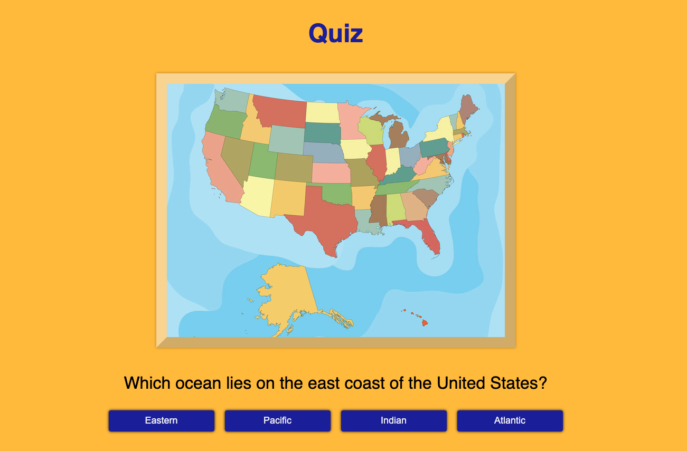
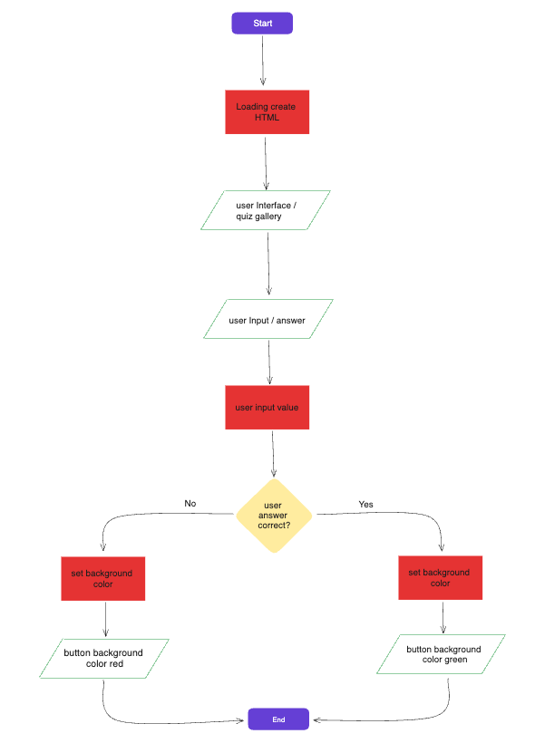
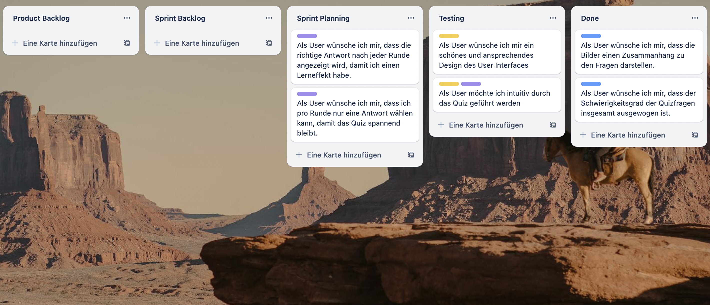

# JavaScript Project: Quiz

The Project Quiz is a JavaScript-based quiz application that displays a set of questions along with multiple-choice answers. Users can make their selections, and the application provides immediate feedback on the correctness of their choices. The project aims to demonstrate a simple quiz implementation using JavaScript, HTML and SCSS.

## Project Features

- Dynamic presentation of quiz questions with images
- Immediate feedback on selected answers
- Highlighting correct answers
- Simple and intuitive user interface

## Quiz Data

The quiz questions and answers are stored in the data array within the JavaScript file. Each quiz item includes an image URL, a question, an array of choices, and the correct answer.

## How It Works

The quiz application automatically loads a series of questions along with corresponding multiple-choice answers and images. Users can make their selections by clicking on the provided buttons. The application provides immediate visual feedback, indicating whether the chosen answers are correct or incorrect.

# Tech Stack

- HTML5
- Vanilla JavaScript
- SASS

## Screenshots

## GitHub Live Preview

(Provide a link to the live preview of the quiz on GitHub Pages if applicable)

## GitHub Repository

(Include a link to the GitHub repository for the quiz project)

## Flowchart

## Starting project

## Project in Progress

## Notes

This project was created as part of a coding bootcamp at supercode.de.
